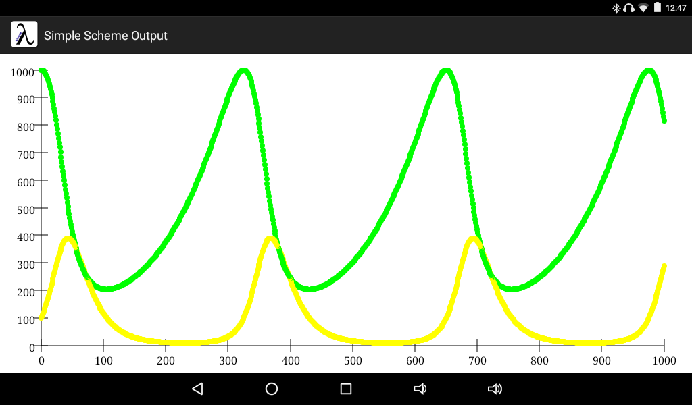

> This folder includes small programs for Simple Scheme.

このフォルダは [Simple Scheme](http://bryanchadwick.com/simplescheme/) で実行できる小さなプログラムを収録しています。
## [Google Play Store](https://play.google.com/store/apps/details?id=chadwick.apps.simplescheme) で紹介されてるサンプルプログラム
手入力するのが面倒と思ったあなたのために、私がやりました(恩着せがましく)
- [sample1.scm](about-simple-scheme/sample1.scm) 描画サンプル
	<br>
- [sample2.scm](about-simple-scheme/sample2.scm) REPLっぽいサンプル
	<br>
## 私が作ったもの
- rk4.scm
	- rk4 ４次のルンゲ・クッタ法で常微分数値解析する関数
	- diagram 簡単なグラフ作成関数
	- 上記２つの関数を使って Lotka-Volterra の方程式を数値解析しグラフにします。
	<br>
	- 参考: [数値計算を使って上微分方程式を解く〜ルンゲクッタ法の解説〜](http://shimaphoto03.com/science/rk-method/)
<!---
- my.scm ときどき引数の順番を変えたいと思うことありません？
	- my-foldl (foldl f ini lst) を (my-foldl ini lst f) に変えただけのマクロ
		- Haskell の foldl は左結合関数を前提としていますが、Simple Scheme の foldl は右結合関数を前提とした仕様のようです。
		- SRFI-1 の fold はリスト引数を複数個扱える、つまり、(fold <関数> <初期値> <リスト1> <リスト2> ...) できるが、Simple Scheme の foldl はリストを１つしか扱えません。
		- SRFI-1 の reduce は初期値が空リストのとき空リストとリストの最初の要素を引数にした関数実行を省略するが、Simple Scheme の foldl は省略しません。
	- my-map (map f lst) を (my-map lst f) に変えただけのマクロ
-->
# Simple Scheme について、もう少し詳しく
- scheme ライクなプログラミング言語
- 動作環境は Android
- 線とか四角とか丸とか簡単に描ける
- 対応する括弧をマークしてくれるエディタ付き
## 一般的な Scheme との違い。
どうしても足りない部分を書くことになってしまうが、大概のことは回避できるものです。
ただ、eval も apply もないのは困る。
load 関数もファイル入出力関数もない。
なのにプログラムを書くのが楽しい不思議なアプリ！
### マジかよ！？ pair が作れない！・・・リストでいいや。
```
;lang-dif1.scm
;NG
;(cons 1 2) ; => RuntimeExceptoon: Cannot convert 2 to a list value
;OK
(cons 1 '(2))           ; => (list 1 2)
(cons 1 (cons 2 '()))   ; => (list 1 2)
(cons 1 (cons 2 empty)) ; => (list 1 2)
```
### rest 引数は使えないってことですね。
```
;lang-dif2.scm
;NG
;(define (raw . lst) lst) ; => Cannot [Run]
;(raw 1 2 3)              ; => I need (list 1 2 3)
;OK
(define (raw lst) lst)
(raw '(1 2 3))            ; => (list 1 2 3)
```
#### これを不便と思う？
そう思われる方もいらっしゃるでしょう。
私はこのシンプルさが好きです。
これで機能の損失が発生する状況が思い浮かばない。
括弧は増えるけど、ひとつだけだし問題なし。
### マジかよ！？ 名前付き let が使えない！・・・letrec でいいか。
```
;lang-dif3.scm
;NG
;(define (fact n)
;  (let loop ((acc 1) (n n))
;    (if (<= n 1)
;      acc
;      (loop (* acc n) (- n 1)))))
;OK
(define (fact n)
  (letrec ([loop (lambda (acc n)
                   (if (<= n 1)
                     acc
                     (loop (* acc n) (- n 1))))])
    (loop 1 n)))
(fact 5) ; => 120
```
### マジかよ！？ define の中で define が使えない！・・・letrec で以下略
```
;lang-dif4.scm
;NG
;(define (fact n)
;  (define (loop acc n)
;    (if (<= n 1)
;      acc
;      (loop (* acc n) (- n 1)))))
;OK
(define (fact n)
  (letrec ([loop (lambda (acc n)
                   (if (<= n 1)
                     acc
                     (loop (* acc n) (- n 1))))])
    (loop 1 n)))
(fact 5) ; => 120
```
## [Bryan Chadwick って人が作ったそうな](http://bryanchadwick.com)
米若手上院議員みたいな風貌。
論文書いて博士号取ってるドインテリ。
こんなヤツ褒めたくないｗ


